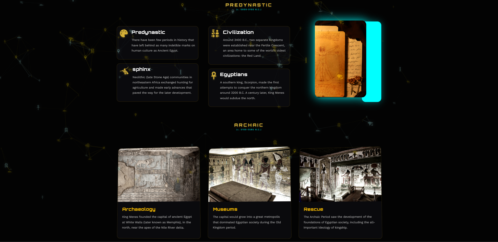

# 🏺 Ancient Egyptians Interactive Website

A modern web experience inspired by Ancient Egyptian Civilization.

## 🔗 Live Demo
[View Website](https://web-project-ancient-egyptians.netlify.app/)

## 💻 Technologies Used
- HTML
- CSS
- JavaScript

## 📌 Features
- Interactive design
- Smooth animations
- Ancient Egypt themed UI

## 👨‍💻 Author
Khaled Aidia

## 🎓 Project Info
Web Development course project  
El Shorouk Academy  

Supervised by:
- Dr. Mohamed Mostafa  
- Eng. Salma Ayman

## 🎥 Project Demo

